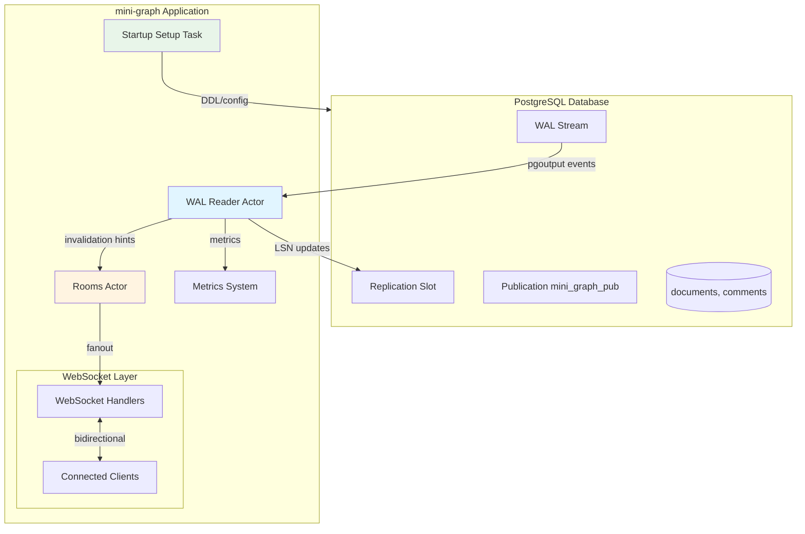
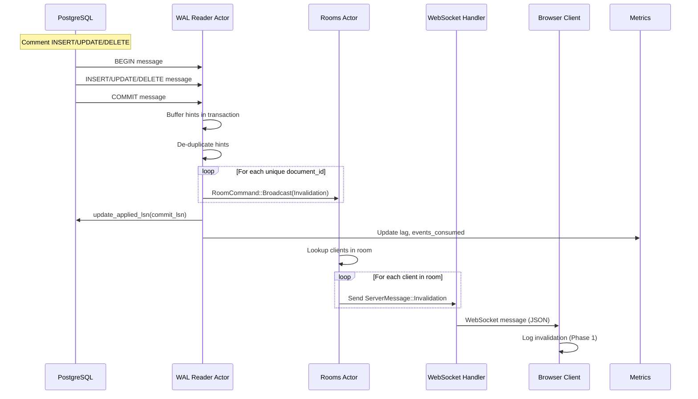

# Design: PostgreSQL WAL Integration for Real-time Document Invalidation

## Overview

This design implements real-time change data capture from PostgreSQL using logical replication (pgoutput protocol) to automatically invalidate document subscriptions. The architecture follows the established actor model pattern with bounded channels, adding a dedicated WAL reader task that consumes replication stream events, generates document-scoped invalidation hints, and delivers them to the existing rooms actor for fanout to WebSocket clients. The implementation uses the pgwire-replication crate for wire protocol handling, tracks LSN progress in-memory for WAL cleanup, and provides automated PostgreSQL setup with manual testing tools.

## Architecture



## Components

### WAL Reader Actor

**Purpose**: Consume PostgreSQL logical replication stream and generate document-scoped invalidation hints.

**Responsibilities**:
- Establish replication connection using pgwire-replication crate
- Decode pgoutput binary messages (BEGIN, INSERT, UPDATE, DELETE, COMMIT)
- Extract relevant keys (Phase 1: document_id) from row data for hint generation
- Send invalidation hints to rooms actor via bounded channel
- Report LSN progress to PostgreSQL at commit boundaries
- Track metrics (events consumed, dropped, lag)
- Reconnect on connection loss with exponential backoff

**Interfaces**:
```rust
pub struct WalReaderHandle {
    tx: mpsc::Sender<WalReaderCommand>,
}

enum WalReaderCommand {
    Stop,
}

struct WalReaderActor {
    client: ReplicationClient,
    rooms: RoomsHandle,
    metrics: Arc<Metrics>,
    last_applied_lsn: u64,
    current_transaction: TransactionBuffer,
}

struct TransactionBuffer {
    // Buffer structured hints until COMMIT, then route them.
    // This keeps WAL decoding and delivery decoupled from the current routing scheme.
    hints: HashSet<QueryHint>,
}

struct HintRouter {
    // Phase 1: route specific hints to document rooms.
    // Future: replace with Edge inverted index (hint -> subscriptions).
}
```

**State Management**:
- LSN tracking: `AtomicU64` for thread-safe access by metrics endpoint
- Transaction buffer: Accumulate hints until COMMIT, then flush to rooms actor
- Connection state: Owned by actor, reconnect logic on stream errors

### PostgreSQL Setup Task

**Purpose**: Automate PostgreSQL configuration on server startup.

**Responsibilities**:
- Create `documents` and `comments` tables if not exist
- Set `REPLICA IDENTITY FULL` on `comments` (required so DELETE events include `document_id`)
- Create publication `mini_graph_pub` if not exist
- Create replication slot `mini_graph_slot` if not exist
- Log setup actions and errors with actionable messages

**Interfaces**:
```rust
pub async fn setup_postgres(config: &PostgresConfig) -> Result<(), SetupError>;

struct PostgresConfig {
    host: String,
    port: u16,
    user: String,
    password: String,
    database: String,
    slot_name: String,
    // Optional suffix to avoid collisions if multiple instances run.
    // Default behavior uses a stable name (e.g. "mini_graph_slot").
    slot_name_suffix: Option<String>,
}

#[derive(Debug)]
enum SetupError {
    ConnectionFailed(String),
    InsufficientPermissions(String),
    QueryFailed { query: String, error: String },
}
```

### Invalidation Hint Generator

**Purpose**: Transform WAL events into invalidation hints (inverted index keys).

**Design note:** Hints are structured (`QueryHint`) internally for type-safety and to avoid routing logic that depends on parsing `table:column:value` strings. We only serialize to strings at the WebSocket boundary.

**Responsibilities**:
- Parse pgoutput tuple data to extract column values
- Generate structured hints (later serialized as `table:column:value` strings)
- Handle DELETE events using old tuple data (requires REPLICA IDENTITY FULL on `comments`)
- Generate multiple hints when needed (e.g., comment moved documents)

**Interfaces**:
```rust
#[derive(Debug, Clone, Eq, PartialEq, Hash)]
struct QueryHint {
    table: String,
    column: String,
    value: String,
}

impl QueryHint {
    fn to_key(&self) -> String;
}

fn generate_invalidation_hints(event: &WalEvent) -> Vec<QueryHint>;

enum WalEvent {
    Insert {
        relation_id: u32,
        relation_name: String,
        new_tuple: TupleData,
    },
    Update {
        relation_id: u32,
        relation_name: String,
        old_tuple: Option<TupleData>,
        new_tuple: TupleData,
    },
    Delete {
        relation_id: u32,
        relation_name: String,
        old_tuple: TupleData,
    },
}

struct TupleData {
    columns: HashMap<String, Value>,
}

#[derive(Debug, Clone)]
enum Value {
    Null,
    Text(String),
    Int(i64),
}
```

### Metrics Extension

**Purpose**: Extend existing Metrics struct with WAL-specific observability.

**Responsibilities**:
- Track events consumed, dropped, lag
- Expose slot health (active status, retained bytes)
- Report current LSN position

**Interfaces**:
```rust
impl Metrics {
    pub fn inc_wal_events_consumed(&self);
    pub fn inc_wal_events_dropped(&self);
    pub fn set_wal_lag_seconds(&self, lag: u64);
    pub fn set_wal_lsn(&self, lsn: u64);
    pub fn set_wal_slot_active(&self, active: bool);
    pub fn set_wal_retained_bytes(&self, bytes: u64);
}

// Add to MetricsSnapshot:
pub struct MetricsSnapshot {
    // ... existing fields
    pub wal_events_consumed_total: u64,
    pub wal_events_dropped_total: u64,
    pub wal_lag_seconds: u64,
    pub wal_lsn: u64,
    pub wal_slot_active: bool,
    pub wal_retained_bytes: u64,
}
```

### ServerMessage Extension

**Purpose**: Add new variant to carry invalidation hint keys to clients.

**Responsibilities**:
- Serialize invalidation hints for WebSocket delivery
- Maintain compatibility with existing message types

**Interfaces**:
```rust
// Extend existing ServerMessage enum:
#[derive(Debug, Clone, Serialize, Deserialize)]
#[serde(tag = "type", rename_all = "snake_case")]
pub enum ServerMessage {
    // ... existing variants (Joined, Message, Error)
    Invalidation {
        hints: Vec<String>,
        timestamp: u64,
    },
}
```

### Manual Verification

**Purpose**: Keep Phase 1 iteration tight by verifying end-to-end behavior with simple SQL writes.

**Approach**:
- Use Docker Postgres for a reproducible local environment
- Use `psql` (or any SQL client) to INSERT/UPDATE/DELETE rows in `comments` and DELETE rows in `documents`
- Observe `ServerMessage::Invalidation` messages in the browser client


## Data Flow



**Detailed Steps**:

1. PostgreSQL commits transaction containing comment changes
2. WAL reader receives BEGIN, INSERT/UPDATE/DELETE, COMMIT messages via replication stream
3. WAL reader accumulates document-scoped invalidation hints in a per-transaction buffer during event processing
4. On COMMIT, WAL reader de-duplicates hints per document_id (e.g., multiple comments on the same document → one invalidation)
5. WAL reader routes buffered hints to target rooms (Phase 1: document_id rooms) and calls `rooms.broadcast_to_room(document_id, ServerMessage::Invalidation { hints })`
6. Rooms actor looks up clients subscribed to that document room
7. Rooms actor attempts `try_send` to each client's outbound channel
8. If channel full: increment `fanout_drops_total` metric, drop message for that client
9. If channel closed: remove client from room
10. After COMMIT is processed and invalidation enqueue attempts are made (even if some were dropped), WAL reader calls `client.update_applied_lsn(commit_lsn)`
11. PostgreSQL marks WAL as consumed, allows recycling

## Technical Decisions

| Decision | Options Considered | Choice | Rationale |
|----------|-------------------|--------|-----------|
| WAL consumption crate | pgwire-replication, Supabase ETL (pg_replicate), tokio-postgres + manual protocol | **pgwire-replication** | Provides explicit LSN control, clean async tokio integration, avoids heavyweight framework. Learning-focused project benefits from lower-level access. |
| LSN persistence | In-memory AtomicU64, SQLite checkpoint, PostgreSQL table checkpoint | **In-memory AtomicU64** (Phase 1) | Simplifies implementation; acceptable data loss on restart for demo. Future: persist to SQLite or DB table. |
| Actor topology | Extend rooms actor with WalEvent handling, separate EventsActor, direct broadcast channel | **Direct invalidation to rooms actor** | Rooms actor already handles fanout; adding WalEvent variants adds complexity. WAL reader generates hints upstream and uses existing `broadcast_to_room` API. |
| Channel capacity | 128, 256, 512, 1024 | **256** | Matches existing rooms actor pattern. Large transactions may burst, but 256 handles typical workload. Configurable constant enables tuning. |
| Hint de-duplication | Per-event (no buffer), per-transaction buffer with HashSet, no de-duplication | **Per-transaction HashSet** | Multiple comments in one transaction targeting same document should generate one invalidation. HashSet ensures uniqueness without complex logic. |
| PostgreSQL setup automation | Manual DBA setup, startup automation (idempotent), migration framework | **Startup automation (idempotent)** | Local dev ergonomics; safe to run repeatedly. Production may use external migrations, but automation doesn't prevent that. |
| Replication slot naming | Static "mini_graph_slot", config-based suffix, UUID | **Configurable (default: "mini_graph_slot")** | Keep a stable default for single-instance dev, while allowing an override (or suffix) if multiple instances are ever run against one Postgres. |
| DELETE event handling | Ignore deletes, require REPLICA IDENTITY FULL, REPLICA IDENTITY INDEX | **REPLICA IDENTITY FULL (comments only)** | Comment DELETE events must include `document_id` for correct routing. Use `REPLICA IDENTITY FULL` on `comments` only; keep `documents` at default replica identity (primary key is sufficient for Phase 1). |
| Transaction streaming | Wait for COMMIT, stream in-progress (pgoutput v2) | **Wait for COMMIT** | Ensures transactional consistency; avoids rollback complications. Large transaction streaming is optimization for >1GB transactions (unlikely in Phase 1). |
| LSN advancement timing | After event consumed, after enqueue attempts, after client delivery ACK | **After COMMIT processed and enqueue attempts made** | Keeps WAL retention under control even under backpressure. Invalidations are best-effort; a full rooms channel can cause missed invalidations, but replication progress still advances. |
| Schema change handling | Ignore (restart required), hot-reload relation cache, fail fast | **Fail fast (restart required)** | Simplifies implementation; DDL mid-stream is rare in demo. Production needs relation message parsing + cache update (future). |
| Error reconnection strategy | No retry (fail permanently), fixed backoff, exponential backoff | **Exponential backoff (1s, 2s, 4s, max 30s)** | Prevents thundering herd on PostgreSQL; gives DB time to recover. Max 30s prevents indefinite retry spam. |
| Control-plane vs data-plane connections | Single replication connection, separate tokio-postgres for DDL | **Separate connections** | Replication connection is long-lived stream; DDL queries need request-response. pgwire-replication handles data plane, tokio-postgres for control plane. |

## File Structure

| File | Action | Purpose |
|------|--------|---------|
| src/wal/mod.rs | Create | Module entry point, exports public types and WalReaderHandle |
| src/wal/reader.rs | Create | WalReaderActor implementation, replication stream consumption loop |
| src/wal/hint_generator.rs | Create | Invalidation hint generation logic from WalEvent to hint strings |
| src/postgres/mod.rs | Create | Postgres module entry point (setup/config helpers) |
| src/postgres/setup.rs | Create | PostgreSQL setup automation (DDL, publication, slot creation) |
| src/wal/types.rs | Create | WAL-specific types (WalEvent, TupleData, Value, errors) |
| src/metrics.rs | Modify | Add WAL-specific metrics (5 new fields + methods) |
| src/types.rs | Modify | Add ServerMessage::Invalidation variant |
| src/state.rs | Modify | Add WalReaderHandle to AppState |
| src/lib.rs | Modify | Start WAL reader actor on server startup, call postgres setup |
| tests/wal_hint_generation_test.rs | Create | Unit tests for hint generation logic with mock WalEvent inputs |

## Error Handling

| Error Scenario | Handling Strategy | User Impact |
|----------------|-------------------|-------------|
| PostgreSQL connection failure on startup | Log error with connection details, retry with exponential backoff (1s → 30s max), block server startup until connected or max retries | Server startup delayed; clear logs indicate DB unavailable |
| Replication stream disconnected mid-operation | Log disconnection, attempt reconnect with exponential backoff, resume from last applied LSN | Brief invalidation gap (missed events during disconnect); resumes automatically |
| Insufficient permissions for replication | Setup task fails fast, logs actionable error ("REPLICATION permission required for user 'foo'") | Server fails to start; operator must grant permissions and restart |
| REPLICA IDENTITY not set on table | Setup task sets it automatically (idempotent ALTER TABLE), logs action | No user impact if automation succeeds; manual fix required if ALTER TABLE fails |
| Bounded channel full (rooms actor backpressured) | Drop invalidation(s), increment `wal_events_dropped_total` metric, log warning with document_id; still advance LSN after COMMIT | Some clients may miss invalidation; WAL retention remains bounded; metric alerts operator to tuning need |
| Replication slot missing (deleted externally) | Setup task recreates slot on next startup, replication resumes from new LSN (data loss acceptable) | Missed invalidations for events between slot deletion and recreation; logged as warning |
| Long-running transaction causes lag spike | Monitor `wal_lag_seconds` metric, log warning if exceeds threshold (e.g., 10s) | Delayed invalidations; operator alerted via metrics; no crash |
| Schema change (ALTER TABLE) mid-stream | Fail fast: log error "Schema change detected, restart required", exit WAL reader actor | Invalidations stop; operator must restart server after schema stabilizes |
| Malformed pgoutput message | Log parse error with hex dump of message, skip event, increment `wal_events_dropped_total` | Single event lost; operator alerted via logs and metrics |
| Hint generation failure (missing document_id column) | Log error with table name and available columns, skip event, increment `wal_events_dropped_total` | Single invalidation lost; indicates schema mismatch or bug |

## Edge Cases

- **UPDATE changes document_id (comment moved to different document)**: Generate two invalidation hints—one for old document_id (from old tuple) and one for new document_id (from new tuple). Both rooms receive invalidation.

- **Multiple comments on same document in one transaction**: Transaction buffer de-duplicates hints using `HashSet<QueryHint>`. Router groups them so each affected document room is broadcast to at most once per commit.

- **Document DELETE followed by comment INSERT on same document_id in transaction**: Both hints generated: `documents:id:<id>` and `comments:document_id:<id>`. Rooms actor delivers both. Client receives invalidation for deleted document (harmless, client may already know document is gone).

- **Replication slot reaches max_slot_wal_keep_size**: Slot becomes invalid, PostgreSQL logs error. WAL reader reconnect fails (slot unusable). Operator must drop slot manually (e.g., via `psql`) and restart server (creates a new slot, loses replication position).

- **Client channel full during invalidation fanout**: `try_send` fails, metric incremented, message dropped for that client only. Other clients in room still receive invalidation. Slow client experiences stale data until next change.

- **WAL reader starts before rooms actor ready**: Server startup sequence ensures rooms actor starts first (line order in run_server). If rooms handle not available, WAL reader panics on startup (fail fast, indicates initialization bug).

- **Zero clients in room when invalidation arrives**: Rooms actor lookup returns empty client list, no fanout occurs. No error; invalidation discarded silently. Next client to join room subscribes to future invalidations.

- **Transaction with only documents INSERT/UPDATE (Phase 1 ignores these)**: No hints generated (routing rule filters out document INSERT/UPDATE). COMMIT processed, LSN advanced, no invalidations sent. WAL events consumed metric still increments.

- **PostgreSQL 14+ streaming in-progress transaction (pgoutput v2)**: Phase 1 implementation ignores streaming messages (processes only at COMMIT). Large transaction buffered in memory until COMMIT (potential memory spike). Future: handle streaming messages for chunked processing.

- **Replication connection loss during COMMIT processing**: Reconnect resumes from last applied LSN. If LSN not yet advanced (COMMIT not processed), transaction re-delivered. De-duplication in transaction buffer prevents double invalidations.

## Test Strategy

### Unit Tests

**Hint Generation (`tests/wal_hint_generation_test.rs`)**:
- **Test**: Comment INSERT with document_id extracts correct hint
  - **Input**: `WalEvent::Insert { relation_name: "comments", new_tuple: { "document_id": "doc123" } }`
  - **Expected**: `["comments:document_id:doc123"]`
- **Test**: Comment UPDATE with document_id extracts hint from new tuple
  - **Input**: `WalEvent::Update { relation_name: "comments", new_tuple: { "document_id": "doc456" } }`
  - **Expected**: `["comments:document_id:doc456"]`
- **Test**: Comment DELETE with REPLICA IDENTITY FULL extracts hint from old tuple
  - **Input**: `WalEvent::Delete { relation_name: "comments", old_tuple: { "document_id": "doc789" } }`
  - **Expected**: `["comments:document_id:doc789"]`
- **Test**: Comment UPDATE changing document_id generates hints for both old and new
  - **Input**: `WalEvent::Update { old_tuple: { "document_id": "docA" }, new_tuple: { "document_id": "docB" } }`
  - **Expected**: `["comments:document_id:docA", "comments:document_id:docB"]` (order-independent)
- **Test**: Document DELETE extracts hint
  - **Input**: `WalEvent::Delete { relation_name: "documents", old_tuple: { "id": "doc999" } }`
  - **Expected**: `["documents:id:doc999"]`
- **Test**: Document INSERT generates no hint (Phase 1 routing rule)
  - **Input**: `WalEvent::Insert { relation_name: "documents", new_tuple: { "id": "doc111" } }`
  - **Expected**: `[]`
- **Test**: Unknown table generates no hint
  - **Input**: `WalEvent::Insert { relation_name: "users", new_tuple: {} }`
  - **Expected**: `[]`
- **Test**: Missing document_id column logs error, returns empty vec
  - **Input**: `WalEvent::Insert { relation_name: "comments", new_tuple: { "text": "hello" } }`
  - **Expected**: `[]`, error logged (verify via test logging capture)

**Mock Requirements**:
- Construct `WalEvent` enums directly with test data
- No PostgreSQL connection needed
- Use `TupleData` with HashMap of test values

### Integration Tests

**Phase 1 Scope**: No automated integration tests. Manual verification sufficient.

**Future Integration Tests** (if implemented):
- Spin up Docker PostgreSQL with logical replication enabled
- Create test schema (documents, comments tables)
- Use tokio-postgres to INSERT/UPDATE/DELETE test data
- Assert WAL reader emits expected invalidation hints
- Verify LSN advancement via `pg_replication_slots` query

**Tooling**: `testcontainers-rs` for ephemeral PostgreSQL instances

### E2E Tests (Manual Verification)

**Scenario 1: Comment INSERT triggers invalidation**:
1. Start server (connects to local PostgreSQL)
2. Browser client joins document room "doc123"
3. Manual SQL (example): `INSERT INTO comments (document_id, text) VALUES ('doc123', 'hello from wal');`
4. Observe browser DevTools console: `ServerMessage::Invalidation { hints: ["comments:document_id:doc123"] }`

**Scenario 2: Comment UPDATE triggers invalidation**:
1. Setup: Comment already exists in database
2. Browser client joins document room "doc456"
3. Manual SQL (example): `UPDATE comments SET text = 'updated' WHERE document_id = 'doc456';`
4. Observe invalidation message in browser console

**Scenario 3: Comment DELETE triggers invalidation**:
1. Setup: Comment exists
2. Browser client joins document room "doc789"
3. Manual SQL (example): `DELETE FROM comments WHERE document_id = 'doc789' AND id = (SELECT id FROM comments WHERE document_id = 'doc789' LIMIT 1);`
4. Observe invalidation message with hint extracted from old tuple

**Scenario 4: Document DELETE triggers invalidation**:
1. Browser client joins document room "docXYZ"
2. Manual SQL: `DELETE FROM documents WHERE id = 'docXYZ'`
3. Observe invalidation message: `hints: ["documents:id:docXYZ"]`

**Scenario 5: Replication slot health metrics**:
1. Access `/debug/metrics` endpoint
2. Verify `wal_slot_active: true`
3. Verify `wal_retained_bytes > 0`
4. Stop WAL reader, wait 10s, check `wal_slot_active: false`

**Scenario 6: Backpressure handling**:
1. Modify churn script for high rate: `--operations 1000 --rate 100`
2. Observe `/debug/metrics`: `wal_events_dropped_total` should remain 0 or low (<1%)
3. If drops occur: Log review confirms channel full warnings

**Scenario 7: Reconnection after PostgreSQL restart**:
1. Server running, WAL reader connected
2. Restart PostgreSQL container
3. Observe server logs: Disconnection logged, retry attempts with backoff
4. After PostgreSQL available: Reconnection successful, replication resumes
5. Metrics show brief lag spike, then recovery

**Tools**:
- Browser DevTools console for WebSocket message inspection
- `/debug/metrics` endpoint for metrics verification
- Docker PostgreSQL container for reproducible environment
- `psql` (or any SQL client) for issuing INSERT/UPDATE/DELETE

## Performance Considerations

**WAL Event Processing Latency** (NFR-1: <100ms at p99):
- pgwire-replication provides low-overhead wire protocol parsing
- Hint generation is CPU-bound (HashMap lookups, string formatting)
- Bounded channel try_send is non-blocking (no async overhead in hot path)
- Target: Measure end-to-end latency from PostgreSQL commit to rooms actor enqueue
- Profiling: Add timestamp to COMMIT message, compare to hint delivery timestamp
- If p99 exceeds 100ms: Optimize hint generation (preallocate strings, cache formatters)

**Memory Footprint** (NFR-4: <10MB for 512-event buffer):
- Bounded channel capacity: 256 events × ~500 bytes/event (estimate) = ~128KB
- Transaction buffer HashSet: Typical transaction <100 hints × 50 bytes/hint = 5KB
- pgwire-replication internal buffers: ~8KB (default buffer_events: 8192 in config)
- Total estimated: <1MB for WAL reader state
- Monitor: Add `wal_memory_bytes` gauge tracking transaction buffer size (future)

**Backpressure Handling** (NFR-2: <1% dropped at 10x normal rate):
- Normal rate assumption: 10 events/second
- 10x rate: 100 events/second
- Channel capacity 256 provides ~2.5s buffer at 100 events/sec
- If rooms actor fanout takes >2.5s per batch, drops occur
- Mitigation: Monitor `wal_events_dropped_total`, tune channel capacity upward
- Alternative: Switch from try_send to send().await with timeout (backpressure to PostgreSQL)

**PostgreSQL Impact**:
- Logical replication CPU overhead: ~5-10% per active slot (PostgreSQL docs)
- Network bandwidth: Minimal (only 2 tables, no large columns)
- WAL retention: Monitor `wal_retained_bytes` metric, alert if >100MB
- Publication filtering reduces overhead (only documents, comments tables in publication)

## Security Considerations

**PostgreSQL Credentials**:
- Connection string contains password; must not be logged
- Environment variables for configuration: `POSTGRES_HOST`, `POSTGRES_USER`, `POSTGRES_PASSWORD`
- Avoid hardcoding credentials in source code
- Future: Use pgpass file or connection URI with credentials masked in logs

**Replication Permissions**:
- User must have `REPLICATION` privilege (elevated permissions)
- Principle of least privilege: Create dedicated replication user, grant only REPLICATION + SELECT on target tables
- Phase 1 assumes a single local/dev user with `REPLICATION` + DDL privileges so startup setup can run automatically

**Logical Replication Security**:
- Replication connection should use TLS (pgwire-replication supports rustls)
- Validate SSL certificates in production (disable `sslmode=disable` in prod config)
- Replication slot names are predictable (`mini_graph_slot`); no security risk (server-side resource)

**Invalidation Hint Injection**:
- Hints are derived from database row data (trusted source)
- No user input directly influences hint format
- Hint validation: Assert format matches `^\w+:\w+:.+$` regex (sanity check, not security boundary)

**Denial of Service**:
- Malicious actor could INSERT large volume of comments to flood invalidations
- Mitigation: Bounded channel drops excess events (prevents memory exhaustion)
- Rate limiting: Not in Phase 1 scope; application-level rate limiting on comment INSERT (future)

**PostgreSQL Slot Abuse**:
- Unused slots cause WAL bloat (resource exhaustion attack)
- Mitigation: Manual cleanup via `psql` (drop slot if needed), monitor `wal_retained_bytes` metric
- Future: Automated slot cleanup on server shutdown (drop slot if safe)

## Existing Patterns to Follow

Based on codebase analysis:

**Actor Model with Handle Pattern** (src/rooms.rs):
- Public `WalReaderHandle` struct with `Sender<WalReaderCommand>`
- Private `wal_reader_actor` async function spawned via `tokio::spawn`
- Handle provides public API methods (`start`, `stop`)
- Actor owns mutable state, receives commands via bounded channel

**Bounded Channel Capacity Constant** (src/rooms.rs:9):
- Define `const WAL_READER_CHANNEL_CAPACITY: usize = 256;`
- Use in `mpsc::channel(WAL_READER_CHANNEL_CAPACITY)`
- Enables tuning without magic numbers in code

**Metrics AtomicU64 Pattern** (src/metrics.rs):
- Store counters as `AtomicU64` with `Ordering::Relaxed`
- Provide `inc_*` methods for counters, `set_*` methods for gauges
- Snapshot method collects all metrics into serializable struct
- Metrics struct wrapped in `Arc` for cheap cloning across tasks

**Error Handling with Result Types** (src/types.rs):
- Custom error enums (`WebSocketError`, `RoomCommandError`) with Display impl
- Return `Result<(), CustomError>` from fallible operations
- Map errors at API boundaries (e.g., `TrySendError` → `RoomCommandError`)

**Logging with vprintln** (src/logging.rs - inferred from usage):
- Verbose logging via `crate::logging::vprintln(format_args!(...))`
- Prefix conventions: `[WAL]`, `[ACTOR]`, `[ERR]` for log categorization
- Use format_args! for zero-cost logging when disabled

**Server Startup Sequence** (src/lib.rs:12-24):
- Initialize metrics first (Arc::new, used by all components)
- Start actors in dependency order: rooms → WAL reader
- Spawn background tasks (resource sampler, WAL reader)
- Construct AppState with handles
- Build Axum router with state

**Type Aliases for Domain Types** (src/types.rs:5-6):
- `pub type ClientId = String;`
- `pub type DocumentId = String;`
- Follow pattern: `pub type Lsn = u64;` for WAL LSN positions

**Serde Tagged Enums for Messages** (src/types.rs:46-76):
- `#[serde(tag = "type", rename_all = "snake_case")]` for JSON discriminator
- Enum variants with named fields (struct-like syntax)
- Derive `Debug, Clone, Serialize, Deserialize`

**Non-Blocking Channel Operations** (src/rooms.rs:142):
- Use `try_send` instead of `send().await` in hot paths
- Handle `TrySendError::Full` explicitly (increment metric, log, continue)
- Handle `TrySendError::Closed` by removing stale client

**Graceful Degradation** (src/rooms.rs:144-151):
- On fanout failure (full channel), drop message for slow client but continue with others
- On closed channel, remove client from room and continue
- Never panic in actor event loop; log errors and continue processing

## Implementation Notes

**pgwire-replication Configuration**:
```rust
use pgwire_replication::{ReplicationClient, ReplicationConfig};

let config = ReplicationConfig {
    host: "localhost".to_string(),
    port: 5432,
    user: "replicator".to_string(),
    password: Some("password".to_string()),
    database: "mini_graph".to_string(),
    slot_name: "mini_graph_slot".to_string(),
    publication_name: "mini_graph_pub".to_string(),
    start_lsn: 0, // Resume from beginning or last known LSN
    stop_at_lsn: None, // Continuous streaming
    buffer_events: 256, // Match channel capacity
    ssl_mode: SslMode::Prefer, // Use TLS if available
};

let client = ReplicationClient::connect(config).await?;
```

**LSN Tracking Atomicity**:
- WAL reader actor owns `last_applied_lsn: u64` (private)
- Metrics owns `wal_lsn: AtomicU64` (public for snapshot)
- On COMMIT processed: `actor.last_applied_lsn = commit_lsn; metrics.set_wal_lsn(commit_lsn);`
- Atomic update ensures metrics endpoint sees consistent LSN

**PostgreSQL Control-Plane Queries** (tokio-postgres):
```rust
use tokio_postgres::{NoTls, Client};

async fn create_publication(client: &Client) -> Result<(), Error> {
    client.execute(
        "CREATE PUBLICATION IF NOT EXISTS mini_graph_pub FOR TABLE documents, comments",
        &[]
    ).await?;
    Ok(())
}

async fn set_replica_identity(client: &Client) -> Result<(), Error> {
    client.execute("ALTER TABLE comments REPLICA IDENTITY FULL", &[]).await?;
    Ok(())
}
```

**Transaction Buffer + Routing**:
```rust
use std::collections::HashSet;

struct TransactionBuffer {
    hints: HashSet<QueryHint>,
}

impl TransactionBuffer {
    fn add_hint(&mut self, hint: QueryHint) {
        self.hints.insert(hint);
    }

    fn flush_to_rooms(&mut self, rooms: &RoomsHandle, router: &HintRouter) {
        // Phase 1: route by document_id rooms. Future: replace router with
        // an inverted-index subscriber lookup.
        for (document_id, hints) in router.route(&self.hints) {
            let message = ServerMessage::Invalidation {
                hints: hints.into_iter().map(|h| h.to_key()).collect(),
                timestamp: current_timestamp(),
            };

            // Best-effort delivery: drop on backpressure, but keep replication progress moving.
            let _ = rooms.broadcast_to_room(&document_id, message);
        }

        self.hints.clear();
    }
}

struct HintRouter;

impl HintRouter {
    fn route(&self, hints: &HashSet<QueryHint>) -> Vec<(String, Vec<QueryHint>)>;
}
```

**Exponential Backoff Reconnection**:
```rust
async fn reconnect_with_backoff(config: &ReplicationConfig) -> ReplicationClient {
    let mut delay = Duration::from_secs(1);
    const MAX_DELAY: Duration = Duration::from_secs(30);

    loop {
        match ReplicationClient::connect(config.clone()).await {
            Ok(client) => return client,
            Err(e) => {
                eprintln!("[WAL][ERR] Connection failed: {}, retrying in {:?}", e, delay);
                tokio::time::sleep(delay).await;
                delay = (delay * 2).min(MAX_DELAY);
            }
        }
    }
}
```

**Startup Coordination** (src/lib.rs modification):
```rust
pub async fn run_server() {
    let metrics = metrics::Metrics::new();

    // Setup PostgreSQL (blocks until complete)
    let pg_config = postgres::PostgresConfig::from_env();
    postgres::setup::setup_postgres(&pg_config).await
        .expect("Failed to setup PostgreSQL");

    let rooms = rooms::RoomsHandle::start(metrics.clone());
    let wal_reader = wal::WalReaderHandle::start(pg_config, rooms.clone(), metrics.clone());

    tokio::spawn(metrics::run_resource_sampler(metrics.clone()));

    let state = state::AppState::new(rooms, wal_reader, metrics);

    // ... rest of server setup
}
```

## Dependencies

**New Crate Dependencies** (add to Cargo.toml):
```toml
# PostgreSQL logical replication
pgwire-replication = "0.1"  # Wire protocol client
tokio-postgres = "0.7"       # Control-plane DDL queries
postgres-types = "0.2"       # Type conversions

# Or alternative if pgwire-replication unavailable:
# pg_replicate = "0.x"  # Supabase ETL framework
```

**Dependency Rationale**:
- `pgwire-replication`: Async tokio-based replication client, explicit LSN control
- `tokio-postgres`: Standard async PostgreSQL client for DDL (publications, slots)
- `postgres-types`: Parse pgoutput binary tuple data to Rust types

**Version Pinning**:
- Use exact versions initially to avoid breaking changes during development
- Update to `^` after Phase 1 stable

## Rollout Plan

**Phase 1a: Setup and Infrastructure**:
- Implement `src/postgres/setup.rs` with PostgreSQL automation
- Add metrics fields to `src/metrics.rs`
- Add `ServerMessage::Invalidation` variant
- Manual test: Verify setup task creates tables, publication, slot

**Phase 1b: WAL Reader Core**:
- Implement `src/wal/reader.rs` actor with replication stream consumption
- Implement `src/wal/types.rs` with WalEvent enum
- Add LSN tracking and COMMIT boundary handling
- Manual test: Log received WAL events to console, verify COMMIT boundaries

**Phase 1c: Hint Generation**:
- Implement `src/wal/hint_generator.rs` with routing rules
- Write unit tests for all hint generation scenarios
- Integrate hint generator into WAL reader actor
- Manual test: Run a few SQL INSERT/UPDATE/DELETE statements and verify hints in logs

**Phase 1d: Integration with Rooms**:
- Connect WAL reader to rooms actor via `broadcast_to_room`
- Implement transaction buffer de-duplication
- Update AppState to include WalReaderHandle
- E2E test: Browser client receives invalidation messages

**Phase 1e: Error Handling and Resilience**:
- Implement reconnection with exponential backoff
- Add error logging for all failure scenarios
- Test: Kill PostgreSQL, verify reconnect behavior

**Phase 1f: Metrics and Observability**:
- Wire up all 5 WAL metrics to `/debug/metrics` endpoint
- Manual test: Generate load, verify metrics update correctly

**Deployment Checklist**:
- [ ] PostgreSQL 15+ running with `wal_level=logical`
- [ ] PostgreSQL config: `max_replication_slots >= 1`, `max_wal_senders >= 1`
- [ ] Replication user created with REPLICATION privilege
- [ ] Environment variables set: `POSTGRES_HOST`, `POSTGRES_USER`, `POSTGRES_PASSWORD`
- [ ] Server startup logs show successful PostgreSQL setup
- [ ] `/debug/metrics` shows `wal_slot_active: true`
- [ ] Manual churn test: Invalidations visible in browser console

## Future Enhancements

**LSN Checkpoint Persistence**:
- Save last applied LSN to SQLite or PostgreSQL table every 10 seconds
- On restart, resume from persisted LSN instead of creating new slot
- Prevents invalidation gaps across restarts

**Automatic Slot Cleanup**:
- On graceful shutdown, drop replication slot if safe (no pending WAL)
- Prevent WAL bloat in environments with frequent restarts
- Risk: Premature drop loses replication position

**Schema Change Hot-Reload**:
- Parse Relation messages from pgoutput
- Update in-memory schema cache when columns change
- Continue replication without restart (eliminates manual intervention)

**Multi-Instance Coordination**:
- Config-based slot naming: `mini_graph_slot_{instance_id}` from env var
- Multiple instances with separate slots (each consumes WAL independently)
- Consider single-slot with competing consumers (more complex, lower overhead)

**Backpressure to PostgreSQL**:
- Replace `try_send` with `send().await` with timeout
- If rooms actor stalled, block WAL consumption (natural backpressure)
- Trade-off: Prevents drops but can delay replication

**Query Subscription Tracking** (depends on Cache module):
- Extend WebSocket layer to accept query subscriptions
- Build inverted index: `hint → [subscription_ids]`
- On invalidation, lookup affected subscriptions and trigger cache refresh
- Deliver updated query results to clients

**Incremental View Maintenance** (future):
- Instead of invalidation-and-refetch, compute delta from WAL events
- Apply delta to cached query results (more efficient for large datasets)
- Requires query plan analysis to determine delta computation feasibility
