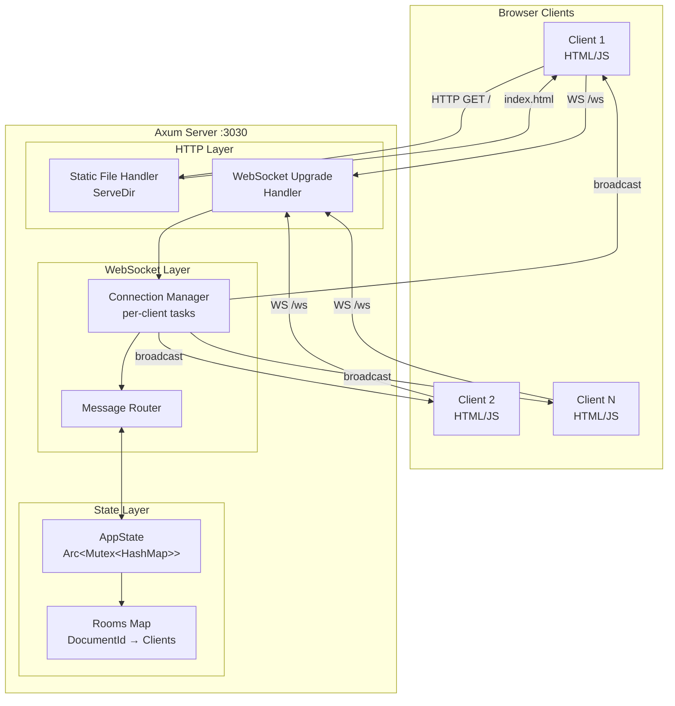
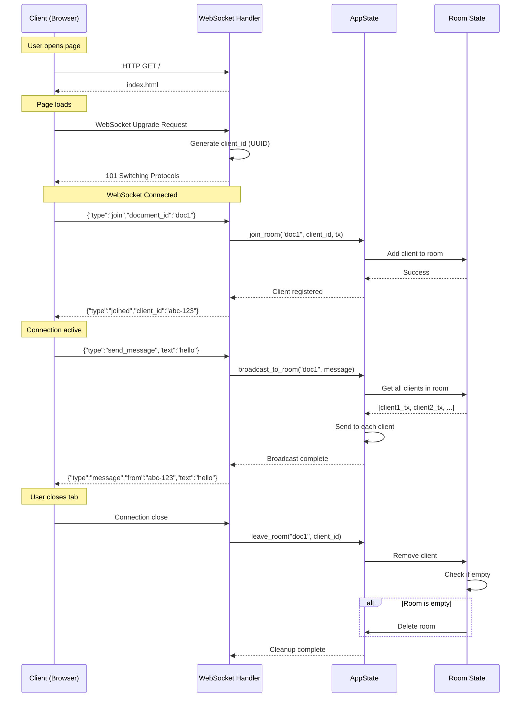
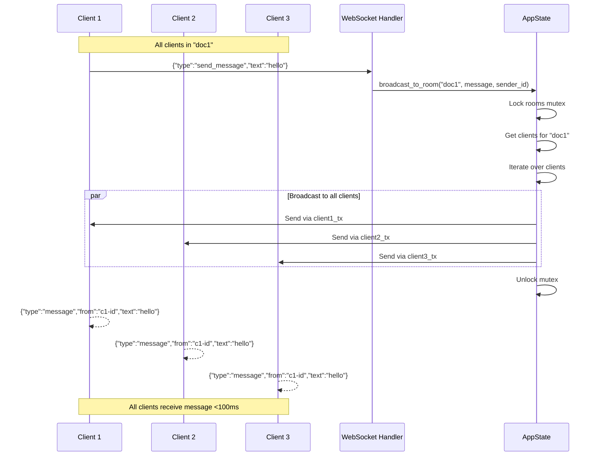

# Design: websocket-setup

## 1. Architecture Overview

### Component Diagram



### Module Responsibilities

#### `main.rs` (Entry Point)
**Responsibility:** Application initialization and server configuration

**Key functions:**
- Configure Axum router with routes
- Initialize shared `AppState`
- Start HTTP/WebSocket server on `0.0.0.0:3030`
- Handle graceful shutdown signals

**Size estimate:** ~100 lines

#### `websocket.rs` (WebSocket Protocol)
**Responsibility:** WebSocket connection lifecycle and message handling

**Key functions:**
- Handle WebSocket upgrade requests
- Split WebSocket into send/receive streams
- Parse incoming JSON messages
- Route messages to appropriate handlers
- Manage per-client send/receive tasks

**Size estimate:** ~200 lines

#### `state.rs` (State Management)
**Responsibility:** Centralized room and client state management

**Key functions:**
- Thread-safe room operations (join, leave, broadcast)
- Client cleanup on disconnect
- Room lifecycle (create on first join, delete when empty)
- Thread-safe access to shared state

**Size estimate:** ~150 lines

#### `types.rs` (Protocol Definitions)
**Responsibility:** Data structures and serialization

**Key functions:**
- Define `ClientMessage` and `ServerMessage` enums
- Implement Serde serialization/deserialization
- Type aliases for `ClientId`, `DocumentId`
- Error type definitions

**Size estimate:** ~100 lines

#### `static/index.html` (Client UI)
**Responsibility:** Browser-based WebSocket client

**Key functions:**
- Split-screen UI (40% input, 60% message stream)
- WebSocket connection management
- Exponential backoff reconnection
- Message display with formatting
- Connection status indicator

**Size estimate:** ~300 lines (HTML/CSS/JS combined)

## 2. Data Flow

### Connection Lifecycle



### Message Broadcasting



## 3. Technical Decisions

| Decision | Options Considered | Chosen | Rationale |
|----------|-------------------|--------|-----------|
| **Web Framework** | tokio-tungstenite directly, Axum, warp | **Axum 0.7** | Built-in WebSocket support via `axum::extract::ws`, Tower ecosystem integration, easy static file serving, active development, excellent ergonomics |
| **Channel Type** | Unbounded mpsc, Bounded mpsc, Broadcast | **Bounded mpsc (100)** | Prevents memory leaks from slow clients (FR-10), bounded backpressure handling, graceful degradation. Per-client channels give fine control vs broadcast's all-or-nothing |
| **State Synchronization** | Arc&lt;Mutex&gt;, Arc&lt;RwLock&gt;, Actor pattern, DashMap | **Arc&lt;Mutex&gt;** | Simple and sufficient for Phase 1. Write-heavy workload (frequent joins/leaves) doesn't benefit from RwLock. Actor pattern adds complexity. DashMap is overkill for moderate scale |
| **Update Strategy** | Full state updates, JSON Patch deltas, Binary diffs | **Full state updates** | Matches mini-graph's invalidation-and-refetch philosophy. Simple to implement and debug. Sufficient bandwidth for text messages. Aligns with FR-5 requirements |
| **Message Protocol** | JSON, MessagePack, Protocol Buffers, Binary custom | **JSON (serde_json)** | Human-readable for debugging (FR-9), browser-native support, no build tooling needed for client, sufficient performance for Phase 1. Binary protocols deferred to Phase 2 if needed |
| **Client ID Generation** | UUID v4, Sequential atomic, Connection hash | **UUID v4** | No coordination needed (FR-3), globally unique, works in distributed systems (future-proof), standard library support via `uuid` crate |
| **Reconnection Strategy** | Fixed delay, Linear backoff, Exponential backoff | **Exponential + jitter** | Prevents thundering herd (FR-13, NFR-6), standard industry practice, base 500ms/max 30s balances UX and server load |
| **Error Handling** | Panic on errors, Result types, anyhow::Error | **Result + logging** | Never panic on client errors (FR-11, NFR-10), allows server to continue serving others, explicit error types for debugging |

## 4. Type Definitions

```rust
// ========== types.rs ==========

use serde::{Deserialize, Serialize};
use std::fmt;

/// Unique client identifier (UUID v4)
pub type ClientId = String;

/// Document/room identifier
pub type DocumentId = String;

/// Messages sent from client to server
#[derive(Debug, Clone, Deserialize)]
#[serde(tag = "type", rename_all = "snake_case")]
pub enum ClientMessage {
    /// Join a document room
    Join {
        document_id: DocumentId,
    },

    /// Send a message to the current room
    SendMessage {
        text: String,
    },
}

/// Messages sent from server to client
#[derive(Debug, Clone, Serialize)]
#[serde(tag = "type", rename_all = "snake_case")]
pub enum ServerMessage {
    /// Confirmation of successful room join
    Joined {
        client_id: ClientId,
        document_id: DocumentId,
    },

    /// Broadcast message from another client
    Message {
        from: ClientId,
        text: String,
        timestamp: u64, // Unix timestamp in milliseconds
    },

    /// Error notification
    Error {
        message: String,
    },
}

impl ServerMessage {
    /// Create a new message broadcast
    pub fn new_message(from: ClientId, text: String) -> Self {
        let timestamp = std::time::SystemTime::now()
            .duration_since(std::time::UNIX_EPOCH)
            .unwrap()
            .as_millis() as u64;

        ServerMessage::Message { from, text, timestamp }
    }
}

/// WebSocket-specific errors
#[derive(Debug)]
pub enum WebSocketError {
    /// Failed to parse JSON message
    InvalidMessage(String),

    /// Client sent message before joining a room
    NotInRoom,

    /// Failed to send message to client (disconnected)
    SendFailed,

    /// WebSocket connection error
    ConnectionError(String),
}

impl fmt::Display for WebSocketError {
    fn fmt(&self, f: &mut fmt::Formatter<'_>) -> fmt::Result {
        match self {
            Self::InvalidMessage(msg) => write!(f, "Invalid message: {}", msg),
            Self::NotInRoom => write!(f, "Must join a room first"),
            Self::SendFailed => write!(f, "Failed to send message"),
            Self::ConnectionError(msg) => write!(f, "Connection error: {}", msg),
        }
    }
}

impl std::error::Error for WebSocketError {}

// ========== state.rs ==========

use crate::types::{ClientId, DocumentId, ServerMessage};
use std::collections::HashMap;
use std::sync::Arc;
use tokio::sync::{mpsc, Mutex};

/// Per-client message sender
type ClientSender = mpsc::Sender<ServerMessage>;

/// Shared application state
#[derive(Clone)]
pub struct AppState {
    /// Map of document_id -> list of (client_id, sender)
    rooms: Arc<Mutex<HashMap<DocumentId, Vec<(ClientId, ClientSender)>>>>,
}

impl AppState {
    /// Create new application state
    pub fn new() -> Self {
        Self {
            rooms: Arc::new(Mutex::new(HashMap::new())),
        }
    }

    /// Add a client to a document room
    pub async fn join_room(
        &self,
        document_id: DocumentId,
        client_id: ClientId,
        sender: ClientSender,
    ) {
        let mut rooms = self.rooms.lock().await;

        rooms
            .entry(document_id.clone())
            .or_insert_with(Vec::new)
            .push((client_id.clone(), sender));

        println!("Client {} joined room {}", client_id, document_id);
    }

    /// Remove a client from their room
    pub async fn leave_room(&self, document_id: &DocumentId, client_id: &ClientId) {
        let mut rooms = self.rooms.lock().await;

        if let Some(clients) = rooms.get_mut(document_id) {
            clients.retain(|(id, _)| id != client_id);

            // Delete room if empty
            if clients.is_empty() {
                rooms.remove(document_id);
                println!("Room {} deleted (empty)", document_id);
            }
        }

        println!("Client {} left room {}", client_id, document_id);
    }

    /// Broadcast a message to all clients in a room
    pub async fn broadcast_to_room(
        &self,
        document_id: &DocumentId,
        message: ServerMessage,
    ) {
        let rooms = self.rooms.lock().await;

        if let Some(clients) = rooms.get(document_id) {
            let mut failed_clients = Vec::new();

            for (client_id, tx) in clients {
                // Clone message for each client
                if tx.send(message.clone()).await.is_err() {
                    // Client disconnected, mark for cleanup
                    failed_clients.push(client_id.clone());
                }
            }

            // Drop lock before cleanup
            drop(rooms);

            // Clean up disconnected clients
            for client_id in failed_clients {
                self.leave_room(document_id, &client_id).await;
            }
        }
    }

    /// Get count of clients in a room (for testing)
    #[cfg(test)]
    pub async fn room_client_count(&self, document_id: &DocumentId) -> usize {
        let rooms = self.rooms.lock().await;
        rooms.get(document_id).map(|c| c.len()).unwrap_or(0)
    }
}

// ========== websocket.rs ==========

use crate::state::AppState;
use crate::types::{ClientId, ClientMessage, DocumentId, ServerMessage, WebSocketError};
use axum::{
    extract::{
        ws::{Message, WebSocket, WebSocketUpgrade},
        State,
    },
    response::Response,
};
use futures::{sink::SinkExt, stream::StreamExt};
use tokio::sync::mpsc;
use uuid::Uuid;

/// Handle WebSocket upgrade request
pub async fn websocket_handler(
    ws: WebSocketUpgrade,
    State(state): State<AppState>,
) -> Response {
    ws.on_upgrade(|socket| handle_socket(socket, state))
}

/// Handle a WebSocket connection
async fn handle_socket(socket: WebSocket, state: AppState) {
    // Generate unique client ID
    let client_id = Uuid::new_v4().to_string();
    println!("New WebSocket connection: {}", client_id);

    // Split socket into sender and receiver
    let (mut sender, mut receiver) = socket.split();

    // Create channel for outgoing messages (bounded to 100)
    let (tx, mut rx) = mpsc::channel::<ServerMessage>(100);

    // Track which room this client is in
    let mut current_room: Option<DocumentId> = None;

    // Spawn task to send messages to client
    let mut send_task = tokio::spawn(async move {
        while let Some(msg) = rx.recv().await {
            // Serialize message to JSON
            if let Ok(json) = serde_json::to_string(&msg) {
                if sender.send(Message::Text(json)).await.is_err() {
                    break; // Client disconnected
                }
            }
        }
    });

    // Main receive loop
    while let Some(Ok(msg)) = receiver.next().await {
        if let Message::Text(text) = msg {
            match handle_client_message(
                &text,
                &client_id,
                &mut current_room,
                &state,
                &tx,
            ).await {
                Ok(()) => {},
                Err(e) => {
                    println!("Error handling message: {}", e);
                    let _ = tx.send(ServerMessage::Error {
                        message: e.to_string(),
                    }).await;
                }
            }
        } else if let Message::Close(_) = msg {
            break;
        }
    }

    // Cleanup on disconnect
    if let Some(room) = current_room {
        state.leave_room(&room, &client_id).await;
    }

    send_task.abort();
    println!("Client {} disconnected", client_id);
}

/// Handle a single client message
async fn handle_client_message(
    text: &str,
    client_id: &ClientId,
    current_room: &mut Option<DocumentId>,
    state: &AppState,
    tx: &mpsc::Sender<ServerMessage>,
) -> Result<(), WebSocketError> {
    // Parse JSON message
    let msg: ClientMessage = serde_json::from_str(text)
        .map_err(|e| WebSocketError::InvalidMessage(e.to_string()))?;

    match msg {
        ClientMessage::Join { document_id } => {
            // Leave current room if in one
            if let Some(old_room) = current_room.take() {
                state.leave_room(&old_room, client_id).await;
            }

            // Join new room
            state.join_room(document_id.clone(), client_id.clone(), tx.clone()).await;
            *current_room = Some(document_id.clone());

            // Send confirmation
            tx.send(ServerMessage::Joined {
                client_id: client_id.clone(),
                document_id,
            })
            .await
            .map_err(|_| WebSocketError::SendFailed)?;

            Ok(())
        }

        ClientMessage::SendMessage { text } => {
            // Must be in a room to send messages
            let room = current_room
                .as_ref()
                .ok_or(WebSocketError::NotInRoom)?;

            // Broadcast to all clients in room
            let message = ServerMessage::new_message(client_id.clone(), text);
            state.broadcast_to_room(room, message).await;

            Ok(())
        }
    }
}

// ========== main.rs ==========

mod state;
mod types;
mod websocket;

use axum::{
    routing::get,
    Router,
};
use state::AppState;
use tower_http::services::ServeDir;

#[tokio::main]
async fn main() {
    // Initialize shared state
    let state = AppState::new();

    // Build router
    let app = Router::new()
        // WebSocket endpoint
        .route("/ws", get(websocket::websocket_handler))
        // Static files (HTML client)
        .nest_service("/", ServeDir::new("static"))
        // Share state with all handlers
        .with_state(state);

    // Start server
    let listener = tokio::net::TcpListener::bind("0.0.0.0:3030")
        .await
        .expect("Failed to bind to port 3030");

    println!("WebSocket server listening on http://0.0.0.0:3030");

    axum::serve(listener, app)
        .await
        .expect("Server failed");
}
```

## 5. Protocol Specification

### Client→Server Messages

#### Join Room
Request to join a document room.

```json
{
  "type": "join",
  "document_id": "demo-doc"
}
```

**Fields:**
- `type`: Must be `"join"`
- `document_id`: String identifier for the document/room to join

**Response:** Server sends `Joined` message (see below)

#### Send Message
Send a text message to the current room.

```json
{
  "type": "send_message",
  "text": "Hello, world!"
}
```

**Fields:**
- `type`: Must be `"send_message"`
- `text`: Message content (string, max length unspecified in Phase 1)

**Validation:**
- Must have joined a room first, otherwise returns error
- Text cannot be empty string

**Response:** Server broadcasts `Message` to all clients in room

### Server→Client Messages

#### Joined Confirmation
Sent after successfully joining a room.

```json
{
  "type": "joined",
  "client_id": "a1b2c3d4-e5f6-7890-1234-567890abcdef",
  "document_id": "demo-doc"
}
```

**Fields:**
- `type`: Always `"joined"`
- `client_id`: Unique UUID v4 assigned to this client
- `document_id`: The room that was joined

#### Message Broadcast
Broadcast message from another client in the room.

```json
{
  "type": "message",
  "from": "a1b2c3d4-e5f6-7890-1234-567890abcdef",
  "text": "Hello, world!",
  "timestamp": 1705267200000
}
```

**Fields:**
- `type`: Always `"message"`
- `from`: Client ID of the sender
- `text`: Message content
- `timestamp`: Unix timestamp in milliseconds

**Note:** Sender also receives their own message via broadcast for consistency.

#### Error Notification
Sent when client request fails.

```json
{
  "type": "error",
  "message": "Must join a room first"
}
```

**Fields:**
- `type`: Always `"error"`
- `message`: Human-readable error description

**Common errors:**
- `"Invalid message: <parse error>"` - Malformed JSON
- `"Must join a room first"` - Tried to send message without joining
- `"Connection error: <details>"` - WebSocket protocol error

## 6. File Structure

| File | Type | Lines | Purpose | Dependencies |
|------|------|-------|---------|--------------|
| `src/main.rs` | Modified | 30 | Server initialization, Axum router setup | axum, tokio, tower-http |
| `src/types.rs` | New | 100 | Protocol message definitions, error types | serde, serde_json |
| `src/state.rs` | New | 150 | Thread-safe state management, room operations | tokio::sync, std::collections |
| `src/websocket.rs` | New | 200 | WebSocket handler, connection lifecycle | axum::extract::ws, uuid, futures |
| `static/index.html` | New | 300 | Browser client UI and logic | None (vanilla JS) |
| `Cargo.toml` | Modified | 20 | Add dependencies | - |

### Module Visibility

```rust
// Public API (pub)
pub struct AppState
pub fn websocket_handler(...)
pub enum ClientMessage
pub enum ServerMessage
pub type ClientId
pub type DocumentId

// Private (crate-internal)
fn handle_socket(...)
fn handle_client_message(...)
type ClientSender

// Test-only
#[cfg(test)]
pub fn room_client_count(...)
```

### Dependency Graph

```
main.rs
  ├─ depends on: state, types, websocket
  ├─ depends on: axum, tower-http, tokio

websocket.rs
  ├─ depends on: state, types
  ├─ depends on: axum, futures, uuid, tokio

state.rs
  ├─ depends on: types
  ├─ depends on: tokio, std::collections

types.rs
  ├─ depends on: serde, serde_json

index.html
  ├─ no Rust dependencies (standalone HTML/JS)
```

## 7. Error Handling

### Error Types

```rust
/// WebSocket-specific errors
#[derive(Debug)]
pub enum WebSocketError {
    /// Failed to parse JSON message from client
    InvalidMessage(String),

    /// Client sent message before joining a room
    NotInRoom,

    /// Failed to send message to client (disconnected)
    SendFailed,

    /// WebSocket connection error
    ConnectionError(String),
}
```

### Error Mapping

| Error Type | User-Visible Message | Action | Logged |
|------------|---------------------|--------|--------|
| `InvalidMessage` | "Invalid message: &lt;details&gt;" | Send error response to client | Yes (warn) |
| `NotInRoom` | "Must join a room first" | Send error response to client | Yes (info) |
| `SendFailed` | None (client disconnected) | Close connection, cleanup state | Yes (info) |
| `ConnectionError` | "Connection error: &lt;details&gt;" | Close connection | Yes (error) |
| Parse JSON failure | "Invalid message: &lt;serde error&gt;" | Send error response | Yes (warn) |
| Channel send timeout | None | Close slow client connection | Yes (warn) |

### Panic-Free Guarantee

**Principle:** Server must never panic due to client behavior (FR-11, NFR-10)

**Enforcement:**
1. All client message parsing uses `Result` types with `.map_err()`
2. Channel sends use `.is_err()` checks, not `.unwrap()`
3. No `.expect()` in request handlers (only in server init)
4. Lock poisoning handled by Tokio's Mutex (no panics)
5. All potential failures explicitly handled with match/if-let

**Testing:** Integration tests deliberately send malformed messages to verify no panics.

### Logging Strategy

```rust
// Use println! for Phase 1, migrate to tracing/log later
println!("Client {} joined room {}", client_id, document_id);      // Info
println!("Error handling message: {}", e);                         // Warn
println!("Client {} disconnected", client_id);                     // Info

// Future: tracing crate
// info!(client_id = %client_id, room = %document_id, "Client joined room");
// warn!(client_id = %client_id, error = %e, "Error handling message");
```

## 8. State Management

### Lock Granularity

**Choice:** Single `Arc<Mutex<HashMap<DocumentId, Vec<...>>>>` for all rooms

**Hold time:** Minimize by following pattern:
1. Acquire lock
2. Read/modify state
3. Clone data needed after lock
4. Drop lock explicitly with `drop(lock)`
5. Perform I/O operations (sending messages)

**Example:**
```rust
pub async fn broadcast_to_room(&self, document_id: &DocumentId, message: ServerMessage) {
    let rooms = self.rooms.lock().await;  // Acquire

    if let Some(clients) = rooms.get(document_id) {
        let clients_to_send = clients.clone();  // Clone while locked
        drop(rooms);  // Drop lock BEFORE sending

        // Send to each client (I/O) without holding lock
        for (client_id, tx) in clients_to_send {
            let _ = tx.send(message.clone()).await;
        }
    }
}
```

**Why not per-room locks?**
- Adds complexity (HashMap of Arc&lt;Mutex&lt;Room&gt;&gt;)
- Creates room requires lock coordination
- Delete empty room requires outer lock anyway
- Phase 1 performance acceptable with single lock

**Future optimization:** If profiling shows lock contention, migrate to DashMap or actor-per-room pattern.

### Cleanup Strategy

#### RAII Cleanup
Not implemented in initial design due to complexity of async Drop. Instead, explicit cleanup in disconnect handler ensures reliability.

#### Explicit Cleanup
```rust
// In handle_socket, after receive loop exits:
if let Some(room) = current_room {
    state.leave_room(&room, &client_id).await;
}
```

**Guarantees:**
- Cleanup runs on normal close, abnormal close, or panic in handler
- Tokio runtime ensures async tasks complete or are cancelled
- Empty rooms deleted immediately when last client leaves

#### Cleanup on Send Failure
```rust
// In broadcast_to_room:
for (client_id, tx) in clients {
    if tx.send(message.clone()).await.is_err() {
        failed_clients.push(client_id.clone());
    }
}

// After loop:
for client_id in failed_clients {
    self.leave_room(document_id, &client_id).await;
}
```

**Rationale:** Detecting failed sends ensures "ghost" clients (disconnected but still in state) are removed promptly.

### Race Condition Prevention

#### Race: Join while broadcast in progress
**Scenario:** Client A joins room while client B sends message.

**Outcome:** Client A may or may not receive message depending on timing.

**Acceptable:** This is eventual consistency. Next message will be received.

#### Race: Two clients leave simultaneously
**Scenario:** Last two clients disconnect at same time.

**Protection:** Mutex ensures serialized access. One removes itself, checks if empty (sees 1 client remaining), doesn't delete. Second removes itself, sees 0 clients, deletes room.

**Guaranteed:** No double-delete due to Mutex serialization.

#### Race: Send to client being removed
**Scenario:** Broadcast attempts to send to client that just disconnected.

**Protection:** Channel send returns error, client added to `failed_clients` list, removed after lock dropped.

**Outcome:** Graceful handling, no panic, automatic cleanup.

### Memory Leak Prevention

**Potential leaks:**
1. **Slow clients fill channel buffers** → Bounded channels (100 cap) prevent unbounded growth
2. **Disconnected clients stay in state** → Cleanup on disconnect + cleanup on send failure
3. **Empty rooms not deleted** → Explicit check and delete in `leave_room`
4. **Circular references** → Rust ownership prevents; no Rc cycles

**Validation:** NFR-3 requires 24-hour stability test to prove no leaks.

## 9. Testing Strategy

### Unit Tests

#### State Management Tests
```rust
#[cfg(test)]
mod tests {
    use super::*;

    #[tokio::test]
    async fn test_join_room() {
        let state = AppState::new();
        let (tx, _rx) = mpsc::channel(100);

        state.join_room("doc1".to_string(), "client1".to_string(), tx).await;

        assert_eq!(state.room_client_count(&"doc1".to_string()).await, 1);
    }

    #[tokio::test]
    async fn test_leave_room_deletes_empty_room() {
        let state = AppState::new();
        let (tx, _rx) = mpsc::channel(100);

        state.join_room("doc1".to_string(), "client1".to_string(), tx).await;
        state.leave_room(&"doc1".to_string(), &"client1".to_string()).await;

        assert_eq!(state.room_client_count(&"doc1".to_string()).await, 0);
    }

    #[tokio::test]
    async fn test_broadcast_to_multiple_clients() {
        let state = AppState::new();
        let (tx1, mut rx1) = mpsc::channel(100);
        let (tx2, mut rx2) = mpsc::channel(100);

        state.join_room("doc1".to_string(), "client1".to_string(), tx1).await;
        state.join_room("doc1".to_string(), "client2".to_string(), tx2).await;

        let msg = ServerMessage::new_message("client1".to_string(), "test".to_string());
        state.broadcast_to_room(&"doc1".to_string(), msg).await;

        // Both clients should receive message
        assert!(rx1.recv().await.is_some());
        assert!(rx2.recv().await.is_some());
    }
}
```

#### Protocol Parsing Tests
```rust
#[test]
fn test_parse_join_message() {
    let json = r#"{"type":"join","document_id":"doc1"}"#;
    let msg: ClientMessage = serde_json::from_str(json).unwrap();

    match msg {
        ClientMessage::Join { document_id } => {
            assert_eq!(document_id, "doc1");
        }
        _ => panic!("Wrong message type"),
    }
}

#[test]
fn test_serialize_joined_message() {
    let msg = ServerMessage::Joined {
        client_id: "abc-123".to_string(),
        document_id: "doc1".to_string(),
    };

    let json = serde_json::to_string(&msg).unwrap();
    assert!(json.contains(r#""type":"joined"#));
}
```

### Integration Tests

#### Multi-Client Same Room
```rust
#[tokio::test]
async fn test_multi_client_same_room() {
    // Start server in background
    tokio::spawn(async {
        // ... start server ...
    });

    // Connect two clients
    let mut client1 = connect_ws("ws://localhost:3030/ws").await;
    let mut client2 = connect_ws("ws://localhost:3030/ws").await;

    // Both join same room
    client1.send(r#"{"type":"join","document_id":"doc1"}"#).await;
    client2.send(r#"{"type":"join","document_id":"doc1"}"#).await;

    // Wait for join confirmations
    let _ = client1.recv().await; // joined message
    let _ = client2.recv().await; // joined message

    // Client 1 sends message
    client1.send(r#"{"type":"send_message","text":"hello"}"#).await;

    // Both should receive broadcast
    let msg1 = client1.recv().await.unwrap();
    let msg2 = client2.recv().await.unwrap();

    assert!(msg1.contains("hello"));
    assert!(msg2.contains("hello"));
}
```

#### Room Isolation
```rust
#[tokio::test]
async fn test_room_isolation() {
    let mut client1 = connect_ws("ws://localhost:3030/ws").await;
    let mut client2 = connect_ws("ws://localhost:3030/ws").await;

    // Join different rooms
    client1.send(r#"{"type":"join","document_id":"doc1"}"#).await;
    client2.send(r#"{"type":"join","document_id":"doc2"}"#).await;

    let _ = client1.recv().await; // joined
    let _ = client2.recv().await; // joined

    // Client 1 sends message
    client1.send(r#"{"type":"send_message","text":"secret"}"#).await;

    // Client 1 receives it
    let msg1 = client1.recv().await.unwrap();
    assert!(msg1.contains("secret"));

    // Client 2 should NOT receive it (timeout after 100ms)
    let msg2 = tokio::time::timeout(
        Duration::from_millis(100),
        client2.recv()
    ).await;

    assert!(msg2.is_err(), "Client 2 should not receive message from different room");
}
```

#### Error Handling
```rust
#[tokio::test]
async fn test_send_without_join() {
    let mut client = connect_ws("ws://localhost:3030/ws").await;

    // Try to send without joining
    client.send(r#"{"type":"send_message","text":"test"}"#).await;

    // Should receive error
    let msg = client.recv().await.unwrap();
    assert!(msg.contains(r#""type":"error"#));
    assert!(msg.contains("Must join a room first"));
}
```

### Manual Testing Procedures

#### Setup
1. Build: `cargo build`
2. Run: `cargo run`
3. Open browser to `http://localhost:3030/`

#### Test Case 1: Single Client Echo
**Steps:**
1. Enter document ID "demo-doc" and click Join
2. Verify status shows "Connected ✓" and displays client ID
3. Enter message "Hello World" and send
4. Verify message appears in right pane with timestamp and client ID

**Success criteria:** Message appears within 100ms

#### Test Case 2: Multi-Client Same Document
**Steps:**
1. Open 3 browser tabs to `http://localhost:3030/`
2. In all tabs, join document "shared-doc"
3. In Tab 1, send message "From Tab 1"
4. Verify all 3 tabs show the message with sender's client ID
5. Send messages from Tab 2 and Tab 3
6. Verify all messages appear in all tabs

**Success criteria:** All clients receive all messages, sender IDs correct

#### Test Case 3: Different Documents Isolation
**Steps:**
1. Open 2 tabs
2. Tab 1: Join document "doc-A"
3. Tab 2: Join document "doc-B"
4. Tab 1: Send message "Private to A"
5. Tab 2: Send message "Private to B"
6. Verify Tab 1 only shows "Private to A"
7. Verify Tab 2 only shows "Private to B"

**Success criteria:** Zero cross-room leakage

#### Test Case 4: Reconnection
**Steps:**
1. Open browser tab and join a room successfully
2. Stop server with Ctrl+C
3. Observe status changes to "Disconnected ✗"
4. Restart server with `cargo run`
5. Observe client automatically reconnects within 5 seconds
6. Verify can send messages again

**Success criteria:** Automatic reconnection without manual refresh

### Performance Testing

#### Load Test: 100 Concurrent Clients
```bash
# Future: Use custom Rust client to spawn 100 clients
cargo test --test load_test_100_clients --release -- --nocapture
```

**Metrics to collect:**
- Connection establishment time
- Message broadcast latency (P50, P95, P99)
- Memory usage over time
- CPU usage under load

**Success criteria (NFR-1, NFR-2):**
- All 100 clients connect successfully
- P95 broadcast latency <100ms
- Memory stable (no growth) over 10 minutes

## 10. Implementation Phases

### Phase 1: Basic Server + Static Files (Day 1, 2 hours)
**Goal:** Get server running and serving HTML client

**Tasks:**
1. Update `Cargo.toml` with dependencies (fix edition to 2021)
2. Create `static/` directory and basic `index.html`
3. Modify `main.rs` to serve static files via `ServeDir`
4. Add WebSocket route placeholder (returns 404 for now)
5. Verify can access `http://localhost:3030/` in browser

**Validation:**
- `cargo run` starts successfully
- Browser shows HTML page
- No compile errors

**FR satisfied:** FR-8 (partial)

---

### Phase 2: WebSocket Connection + Echo (Day 1, 3 hours)
**Goal:** Establish WebSocket connection and echo messages back

**Tasks:**
1. Create `src/types.rs` with `ClientMessage` and `ServerMessage`
2. Create `src/websocket.rs` with `websocket_handler`
3. Implement socket split, message parsing, echo logic
4. Generate client IDs with UUID
5. Update HTML client with WebSocket connection logic

**Validation:**
- Connect from browser DevTools, see WebSocket upgrade succeed
- Send JSON message, receive echo
- Client ID appears in response

**FR satisfied:** FR-1, FR-3, FR-9 (partial)

**User story:** US-1 (partial)

---

### Phase 3: Room Management + Broadcasting (Day 2, 4 hours)
**Goal:** Multi-client room-based broadcasting

**Tasks:**
1. Create `src/state.rs` with `AppState`
2. Implement `join_room`, `leave_room`, `broadcast_to_room`
3. Update `websocket.rs` to handle Join and SendMessage
4. Add cleanup on disconnect
5. Write unit tests for state management

**Validation:**
- Open 2 tabs, join same room, messages broadcast
- Open 2 tabs, join different rooms, messages isolated
- Close tab, client removed from state

**FR satisfied:** FR-2, FR-4, FR-5, FR-6, FR-7

**User stories:** US-2, US-3, US-4

---

### Phase 4: HTML Client + Reconnection (Day 2, 3 hours)
**Goal:** Full-featured browser client with reconnection

**Tasks:**
1. Implement split-screen UI (40/60 layout)
2. Add message formatting with timestamp and client ID
3. Implement exponential backoff reconnection
4. Add connection status indicator
5. Add auto-scroll for message list

**Validation:**
- UI matches design (split screen, formatted messages)
- Stop/restart server, client reconnects automatically
- Status indicator updates correctly

**FR satisfied:** FR-12, FR-13, FR-14, FR-15

**User stories:** US-6, US-7, US-8

---

### Phase 5: Testing + Polish (Day 3, 4 hours)
**Goal:** Production-ready code with tests

**Tasks:**
1. Write unit tests for `state.rs` (join, leave, broadcast)
2. Write integration tests (multi-client, room isolation)
3. Run manual test procedures (all 4 demo scenarios)
4. Add bounded channels (replace unbounded if used)
5. Add error handling improvements
6. Run `cargo clippy` and fix warnings
7. Run `cargo fmt`
8. Add logging statements for debugging
9. Test with 10+ concurrent clients

**Validation:**
- `cargo test` all pass
- All 4 demo scenarios work flawlessly
- Clippy and fmt clean
- No panics under normal or error conditions

**FR satisfied:** FR-10, FR-11

**NFR satisfied:** NFR-1, NFR-2, NFR-3 (partial), NFR-4, NFR-5, NFR-7, NFR-8, NFR-10

---

## Summary

This technical design provides a complete specification for implementing the WebSocket server for mini-graph Phase 1. The design emphasizes:

- **Simplicity**: Single-process, in-memory state, full updates
- **Reliability**: Bounded channels, explicit cleanup, no panics
- **Testability**: Clear module boundaries, unit and integration tests
- **Future-proof**: Abstractions allow migration to distributed state later

The implementation is broken into 5 incremental phases, each building on the previous and delivering working functionality. Total estimated time: 16 hours over 3 days.

All P0 requirements (FR-1 through FR-9, FR-12) and P1 requirements (FR-10, FR-11, FR-13) are addressed in the design. P2 requirements (FR-14, FR-15) are included for completeness but can be simplified if time constrained.

**Next step:** Begin Phase 1 implementation by updating dependencies and creating the static file structure.
